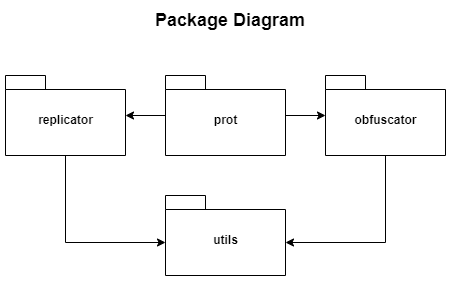

# PROT

Python Replication & Obfuscation Tools (For learning purposes only).
https://github.com/Romansko/PROT.


### Obfuscator

The purpose of the obfuscator is to harden the readability of the code by humans. 
It is achieved by the following techniques which are not ought to be the best way to obfuscate the code, but they are 
good enough for learning purposes.
1. Refactor none reserved variable names.
2. Encode strings with base64.
3. Insert dummy operations.


### Replicator

The Python language is a dynamic, convenient and widely used language around the world. 
Python includes a powerful metaprogramming mechanism. 
This mechanism allows a python program to update its own code at runtime.
Changing the code at runtime could be a significant threat if the code is malicious. 
Replicator packages aims to show the power of the metaprogramming mechanism by infecting python modules and objects at runtime.

<b> All the changes occur only in the virtual environment on RAM. No changes written on disk.</b>
(Unless the user writes such a code).





prot package is mainly the cli.


### PROT Usage

prot has several ways of usage.


#### 1. print help menu

`python prot.py -h`

output:
```
[*] Usage:
        python prot.py -h
                Display help information. (This).
        python prot.py -o <target_file.py>
                Obfuscate a target file.
        python prot.py -rc <injected_code.py>
                Replicate user's code into current interpreter.
        python prot.py -rf <injected_code.py> <target_file.py>
                Load target file & inject code into current interpreter.
```

*Interactive mode was removed for simplicity, hence `python prot.py` will yield the same result.*


#### 2. obfuscate a file

`python prot.py -o <target_file.py>`

or

`python obfuscator.py <target_file.py>`


#### 3. replicate user's code into current interpreter

`python -i prot.py -rc <injected_code.py>`


**Note:** `-i` is python's interpreter command for interactive mode.
It's optional and can be omitted if interactive mode not required. 
However, no Benefit is gained without it in the scenario...


#### 4. replicate user's code into current interpreter with a target file

`python prot.py -rc <injected_code.py> <target_file.py>`

### Examples

* obfuscating hello.py:


* obfuscated hello.py:


* obfuscating the obfuscator:


* injecting code to current interpreter - from python file:

`infected.py`:
```python
mystr = "=== INFECTED ==="
print(mystr)
```


Ignore the exception which related to interpreter interactive mode infection...


* Alternative way of interactive mode infection:


* injecting code to current interpreter with target file loading:

